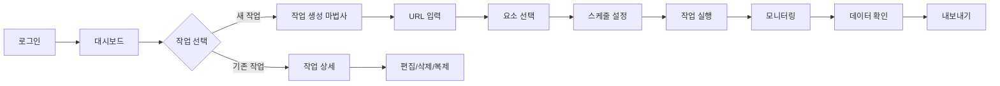
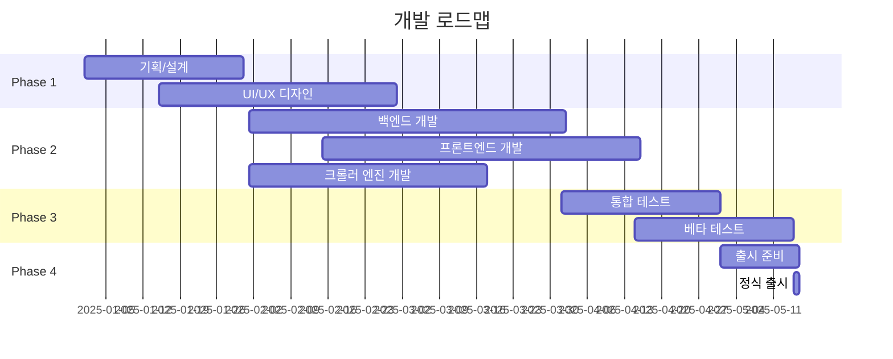

# 📋 Product Requirements Document (PRD)
## CrawlMaster Pro - 웹 크롤링 자동화 플랫폼

---

## 1. 제품 개요

### 1.1 제품명
**CrawlMaster Pro** (크롤마스터 프로)

### 1.2 버전
v1.0.0 (Initial Release)

### 1.3 작성 정보
- **작성자:** Product Manager
- **작성일:** 2025-08-20
- **최종 수정:** 2025-08-20
- **승인자:** CTO, CEO
- **문서 상태:** Draft

### 1.4 제품 비전
> "누구나 쉽게 사용할 수 있는 가장 강력한 웹 데이터 수집 도구"

### 1.5 엘리베이터 피치
CrawlMaster Pro는 코딩을 모르는 일반 사용자도 클릭 몇 번으로 웹사이트의 데이터를 수집하고 분석할 수 있는 올인원 크롤링 플랫폼입니다. 복잡한 설정 없이 직관적인 UI로 데이터 수집부터 시각화까지 한 번에 해결합니다.

---

## 2. 배경 및 목적

### 2.1 문제 정의
```markdown
현재 시장의 문제점:
1. 기존 크롤링 도구는 개발자만 사용 가능
2. 비개발자용 도구는 기능이 제한적
3. 데이터 수집 후 분석 도구가 분리되어 있음
4. 실시간 모니터링 기능 부재
5. 높은 학습 곡선
```

### 2.2 시장 기회
- **TAM (Total Addressable Market):** 전 세계 데이터 분석 시장 $274B
- **SAM (Serviceable Addressable Market):** 웹 스크래핑 도구 시장 $1.8B
- **SOM (Serviceable Obtainable Market):** 한국 시장 $50M

### 2.3 경쟁사 분석
| 제품 | 장점 | 단점 | 가격 |
|------|------|------|------|
| Octoparse | 비주얼 편집기 | 느린 속도 | $75/월 |
| ParseHub | 무료 플랜 | 제한적 기능 | $149/월 |
| Scrapy | 오픈소스 | 개발 지식 필요 | 무료 |
| **CrawlMaster Pro** | **올인원 솔루션** | **신규 제품** | **$49/월** |

---

## 3. 사용자 정의

### 3.1 타겟 사용자

#### Primary Persona: "데이터 분석가 김과장"
```yaml
연령: 32세
직업: 마케팅 팀 데이터 분석가
기술 수준: 중급 (엑셀 고급, 코딩 초급)
목표: 경쟁사 가격 모니터링, 시장 트렌드 분석
페인포인트: 
  - 매일 수동으로 데이터 수집
  - 개발팀에 의존
  - 실시간 데이터 필요
사용 시나리오:
  - 매일 아침 경쟁사 10개 사이트 가격 체크
  - 주간 리포트용 데이터 수집
  - 특정 키워드 뉴스 모니터링
```

#### Secondary Persona: "스타트업 대표 이사장"
```yaml
연령: 35세
직업: 이커머스 스타트업 대표
기술 수준: 초급
목표: 시장 조사, 트렌드 파악
페인포인트:
  - 개발자 채용 비용 부담
  - 빠른 의사결정 필요
  - 제한된 예산
```

### 3.2 사용자 스토리
```markdown
1. "나는 마케터로서 경쟁사 가격을 실시간으로 모니터링하고 싶다"
2. "나는 연구원으로서 뉴스 기사를 주제별로 자동 수집하고 싶다"
3. "나는 사업가로서 시장 트렌드를 한눈에 파악하고 싶다"
4. "나는 분석가로서 수집한 데이터를 바로 차트로 보고 싶다"
5. "나는 관리자로서 팀원들과 데이터를 공유하고 싶다"
```

---

## 4. 기능 요구사항

### 4.1 핵심 기능 (MVP)

#### F1: 비주얼 크롤링 설정
```markdown
설명: 코드 없이 마우스 클릭으로 크롤링 설정
우선순위: P0 (필수)
수용 기준:
  - 웹 페이지 미리보기에서 요소 선택
  - 선택한 요소 하이라이트 표시
  - CSS 선택자 자동 생성
  - 데이터 타입 자동 인식
```

#### F2: 스케줄링
```markdown
설명: 자동 반복 크롤링 설정
우선순위: P0 (필수)
수용 기준:
  - 분/시간/일/주/월 단위 설정
  - 특정 시간대 설정
  - 휴일 제외 옵션
  - 실패 시 재시도 로직
```

#### F3: 데이터 저장 및 내보내기
```markdown
설명: 수집된 데이터 관리
우선순위: P0 (필수)
수용 기준:
  - CSV, Excel, JSON 형식 지원
  - 클라우드 저장소 연동 (Google Drive, Dropbox)
  - 데이터베이스 직접 연결
  - API 제공
```

#### F4: 실시간 모니터링
```markdown
설명: 크롤링 상태 실시간 확인
우선순위: P1 (중요)
수용 기준:
  - 진행률 표시
  - 실시간 로그 스트리밍
  - 에러 알림
  - 성능 메트릭 표시
```

### 4.2 추가 기능 (v1.1)

#### F5: AI 데이터 추출
```markdown
설명: AI를 활용한 스마트 데이터 추출
우선순위: P2 (선택)
수용 기준:
  - 자연어로 추출 규칙 설정
  - 유사 패턴 자동 인식
  - 데이터 품질 자동 검증
```

#### F6: 협업 기능
```markdown
설명: 팀 단위 사용
우선순위: P2 (선택)
수용 기준:
  - 멀티 유저 계정
  - 권한 관리
  - 작업 공유
  - 댓글 및 노트
```

### 4.3 기능 우선순위 매트릭스
```
높음 ┌─────────────┬─────────────┐
영향 │ 🔴 P0       │ 🟡 P1       │
     │ - 비주얼설정 │ - 모니터링   │
     │ - 스케줄링   │ - 알림      │
     │ - 데이터저장 │ - 대시보드   │
     ├─────────────┼─────────────┤
낮음 │ 🟢 P2       │ ⚪ P3       │
     │ - AI 추출   │ - 다크모드   │
     │ - 협업      │ - 커스터마이징│
     └─────────────┴─────────────┘
       낮음          높음
            개발 난이도
```

---

## 5. 비기능 요구사항

### 5.1 성능 요구사항
```yaml
응답 시간:
  - 페이지 로드: < 2초
  - API 응답: < 500ms
  - 크롤링 시작: < 5초

처리량:
  - 동시 크롤링: 100개 작업
  - 초당 페이지: 10 pages/sec
  - 데이터 처리: 10,000 records/min

확장성:
  - 사용자: 10,000 MAU
  - 데이터: 100GB/월
  - 동시 접속: 1,000 users
```

### 5.2 보안 요구사항
```yaml
인증/인가:
  - OAuth 2.0 소셜 로그인
  - 2FA 지원
  - JWT 토큰 기반 인증
  - 역할 기반 접근 제어 (RBAC)

데이터 보안:
  - HTTPS 전송 암호화
  - AES-256 저장 암호화
  - PII 데이터 마스킹
  - GDPR 준수

감사:
  - 모든 액션 로깅
  - 접근 기록 30일 보관
  - 이상 행동 감지
```

### 5.3 사용성 요구사항
```yaml
접근성:
  - WCAG 2.1 AA 준수
  - 키보드 네비게이션
  - 스크린 리더 지원
  - 고대비 모드

지원 환경:
  - 브라우저: Chrome 90+, Firefox 88+, Safari 14+, Edge 90+
  - 모바일: iOS 13+, Android 10+
  - 화면 해상도: 1024x768 이상

다국어:
  - 한국어 (기본)
  - 영어
  - 일본어 (v1.2)
  - 중국어 (v1.2)
```

---

## 6. UI/UX 요구사항

### 6.1 디자인 원칙
```markdown
1. Simple: 복잡한 기능을 단순하게
2. Intuitive: 학습 없이 바로 사용
3. Consistent: 일관된 디자인 언어
4. Responsive: 모든 디바이스 지원
5. Accessible: 모든 사용자 고려
```

### 6.2 주요 화면 구성

#### 6.2.1 대시보드
```
┌────────────────────────────────────────┐
│ 📊 대시보드                             │
├────────────────────────────────────────┤
│ ┌──────────┐ ┌──────────┐ ┌──────────┐│
│ │ 활성작업  │ │ 수집데이터 │ │ 에러율   ││
│ │   24     │ │  125.3K   │ │  0.2%    ││
│ └──────────┘ └──────────┘ └──────────┘│
│                                        │
│ [실시간 활동 그래프]                      │
│                                        │
│ [최근 작업 목록]                         │
└────────────────────────────────────────┘
```

#### 6.2.2 크롤링 설정
```
┌────────────────────────────────────────┐
│ 🔧 새 크롤링 작업                        │
├────────────────────────────────────────┤
│ Step 1: 기본 정보                       │
│ ├─ 작업 이름: [_______________]        │
│ └─ URL: [_____________________]        │
│                                        │
│ Step 2: 데이터 선택                     │
│ ├─ [웹 페이지 프리뷰]                   │
│ └─ 선택된 요소: 5개                     │
│                                        │
│ Step 3: 스케줄 설정                     │
│ └─ 실행 주기: [매일 09:00]              │
│                                        │
│ [이전] [다음] [완료]                     │
└────────────────────────────────────────┘
```

### 6.3 인터랙션 플로우


---

## 7. 기술 스택

### 7.1 아키텍처
```yaml
Frontend:
  - Framework: React 18 + TypeScript
  - State: Redux Toolkit
  - UI: Ant Design / Material-UI
  - Charts: Recharts
  - Build: Vite

Backend:
  - Runtime: Node.js 18 LTS
  - Framework: NestJS
  - Database: PostgreSQL + Redis
  - Queue: BullMQ
  - Storage: AWS S3

Crawler:
  - Core: Puppeteer / Playwright
  - Parser: Cheerio
  - Scheduler: node-cron
  - Proxy: Bright Data

Infrastructure:
  - Cloud: AWS (EC2, RDS, S3, CloudFront)
  - Container: Docker + Kubernetes
  - CI/CD: GitHub Actions
  - Monitoring: Datadog
  - Error: Sentry
```

### 7.2 시스템 아키텍처
```
┌─────────────┐     ┌─────────────┐     ┌─────────────┐
│   클라이언트  │────▶│  API Gateway │────▶│   Backend   │
│   (React)   │     │   (Kong)    │     │  (NestJS)   │
└─────────────┘     └─────────────┘     └─────────────┘
                                               │
                    ┌──────────────────────────┼──────────┐
                    │                          │          │
              ┌─────▼─────┐           ┌───────▼──┐  ┌────▼────┐
              │  Database │           │  Queue   │  │  Cache  │
              │(PostgreSQL)│          │ (BullMQ) │  │ (Redis) │
              └───────────┘           └────┬─────┘  └─────────┘
                                           │
                                    ┌──────▼──────┐
                                    │   Workers   │
                                    │ (Puppeteer) │
                                    └─────────────┘
```

---

## 8. 개발 일정

### 8.1 마일스톤


### 8.2 스프린트 계획
| 스프린트 | 기간 | 주요 목표 | 산출물 |
|---------|------|----------|--------|
| Sprint 1 | 2주 | 기본 CRUD | 로그인, 작업 관리 API |
| Sprint 2 | 2주 | 크롤러 코어 | 기본 크롤링 엔진 |
| Sprint 3 | 2주 | UI 프로토타입 | 대시보드, 작업 생성 화면 |
| Sprint 4 | 2주 | 스케줄러 | 작업 스케줄링 시스템 |
| Sprint 5 | 2주 | 데이터 처리 | 저장, 내보내기 기능 |
| Sprint 6 | 2주 | 모니터링 | 실시간 상태 확인 |
| Sprint 7 | 2주 | 최적화 | 성능 개선, 버그 수정 |
| Sprint 8 | 2주 | QA | 통합 테스트, 문서화 |

---

## 9. 성공 지표 (KPI)

### 9.1 비즈니스 메트릭
```yaml
사용자 지표:
  - MAU: 1,000명 (3개월)
  - DAU: 300명 (3개월)
  - 유료 전환율: 10%
  - 이탈률: < 5%/월

수익 지표:
  - MRR: $5,000 (6개월)
  - ARPU: $50
  - LTV: $600
  - CAC: < $100

제품 지표:
  - NPS: > 50
  - 고객 만족도: > 4.5/5
  - 지원 티켓: < 10건/일
  - 버그 리포트: < 5건/주
```

### 9.2 기술 메트릭
```yaml
성능:
  - 페이지 로드 시간: < 2초
  - API 응답 시간: < 500ms
  - 크롤링 성공률: > 95%
  - 가동 시간: > 99.9%

품질:
  - 코드 커버리지: > 80%
  - 버그 밀도: < 1/KLOC
  - 기술 부채: < 10%
  - 배포 빈도: 2회/주
```

---

## 10. 리스크 및 대응 방안

### 10.1 기술적 리스크
| 리스크 | 확률 | 영향 | 대응 방안 |
|--------|------|------|-----------|
| 웹사이트 차단 | 높음 | 높음 | 프록시 풀, User-Agent 로테이션 |
| 성능 저하 | 중간 | 높음 | 로드 밸런싱, 캐싱 전략 |
| 데이터 유실 | 낮음 | 높음 | 백업, 트랜잭션 로깅 |
| 보안 침해 | 낮음 | 매우 높음 | 정기 보안 감사, 암호화 |

### 10.2 비즈니스 리스크
| 리스크 | 확률 | 영향 | 대응 방안 |
|--------|------|------|-----------|
| 경쟁사 대응 | 높음 | 중간 | 차별화 기능, 가격 경쟁력 |
| 법적 이슈 | 중간 | 높음 | 법률 자문, 이용약관 명시 |
| 시장 수요 부족 | 낮음 | 높음 | MVP 검증, 피벗 준비 |
| 자금 부족 | 중간 | 매우 높음 | 단계별 출시, 투자 유치 |

---

## 11. 부록

### 11.1 용어 정의
```markdown
- Crawler: 웹 페이지를 자동으로 탐색하는 프로그램
- Scraping: 웹 페이지에서 데이터를 추출하는 행위
- Parser: HTML/XML을 분석하여 데이터를 추출하는 도구
- Selector: 특정 HTML 요소를 지정하는 CSS/XPath 표현식
- Rate Limiting: 요청 빈도 제한
- Proxy: 중개 서버를 통한 우회 접속
- User-Agent: 브라우저 식별 정보
- robots.txt: 크롤링 허용/금지 규칙 파일
```

### 11.2 참고 자료
- [Web Scraping Market Report 2024](https://example.com)
- [GDPR Compliance Guide](https://gdpr.eu)
- [Web Accessibility Guidelines](https://www.w3.org/WAI/)
- [REST API Design Best Practices](https://restfulapi.net)

### 11.3 변경 이력
| 버전 | 날짜 | 변경 사항 | 작성자 |
|------|------|-----------|--------|
| 0.1 | 2025-08-01 | 초안 작성 | PM |
| 0.2 | 2025-08-10 | 기능 요구사항 추가 | PM |
| 0.3 | 2025-08-15 | 기술 스택 확정 | CTO |
| 1.0 | 2025-08-20 | 최종 승인 | CEO |

---

## 12. 승인

### 이해관계자 승인
| 역할 | 이름 | 서명 | 날짜 |
|------|------|------|------|
| CEO | 김대표 | _______ | 2025-08-20 |
| CTO | 이기술 | _______ | 2025-08-20 |
| PM | 박매니저 | _______ | 2025-08-20 |
| Lead Dev | 최개발 | _______ | 2025-08-20 |
| Designer | 정디자인 | _______ | 2025-08-20 |

---

*이 PRD는 지속적으로 업데이트되는 살아있는 문서입니다.*
*질문이나 피드백은 pm@crawlmaster.com으로 연락주세요.*