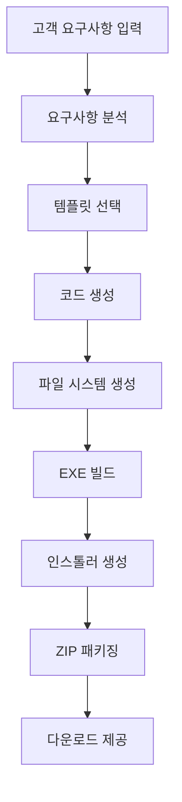

# 🏭 크롤러 팩토리 작동 원리 설명

## 📌 개요
크롤러 팩토리는 **템플릿 기반 코드 생성(Template-based Code Generation)** 시스템으로, 고객 요구사항을 입력받아 자동으로 완전한 크롤러 애플리케이션을 생성합니다.

---

## 🎯 핵심 개념

### 1. Factory Pattern (팩토리 패턴)
```python
# 기본 구조
class CrawlerFactory:
    def create_custom_crawler(self, requirements):
        # 1. 요구사항 분석
        # 2. 템플릿 선택
        # 3. 코드 생성
        # 4. 패키징
        return complete_package
```

### 2. 템플릿 엔진
- 미리 정의된 코드 템플릿
- 변수 치환 방식
- 조건부 코드 생성

---

## 🔄 전체 작동 프로세스



---

## 📝 단계별 상세 설명

### Step 1: 요구사항 입력 및 분석
```python
customer_request = {
    "project_name": "NaverCrawler",
    "target_sites": ["https://news.naver.com"],
    "data_fields": ["제목", "내용", "날짜"],
    "output_format": "excel",
    "crawling_method": "static"
}
```

**분석 과정:**
- 사이트 유형 판단 (정적/동적)
- 필요한 라이브러리 결정
- 최적 크롤링 방식 선택

### Step 2: 템플릿 기반 코드 생성

#### 2.1 크롤러 엔진 템플릿
```python
# crawler_engine_template.py
CRAWLER_ENGINE_TEMPLATE = '''
import requests
from bs4 import BeautifulSoup
{additional_imports}

class {project_name}Engine:
    def __init__(self):
        self.target_sites = {target_sites}
        self.data_fields = {data_fields}
        
    def crawl(self, url):
        {crawling_logic}
        
    def save_data(self, data):
        {save_logic}
'''
```

#### 2.2 변수 치환
```python
def generate_crawler_engine(requirements):
    template = CRAWLER_ENGINE_TEMPLATE
    
    # 변수 치환
    code = template.format(
        project_name=requirements['project_name'],
        target_sites=requirements['target_sites'],
        data_fields=requirements['data_fields'],
        additional_imports=get_imports(requirements),
        crawling_logic=generate_crawling_logic(requirements),
        save_logic=generate_save_logic(requirements)
    )
    
    return code
```

### Step 3: GUI 인터페이스 생성

#### 3.1 동적 UI 구성
```python
def generate_gui(requirements):
    # 필드 수에 따라 UI 레이아웃 조정
    num_fields = len(requirements['data_fields'])
    
    if num_fields <= 5:
        layout = "simple_layout"
    elif num_fields <= 10:
        layout = "tabbed_layout"
    else:
        layout = "scrollable_layout"
    
    return generate_tkinter_code(layout, requirements)
```

#### 3.2 이벤트 핸들러 생성
```python
def generate_event_handlers(requirements):
    handlers = []
    
    # 크롤링 시작 버튼
    handlers.append('''
    def start_crawling(self):
        self.engine = {project_name}Engine()
        self.engine.crawl(self.url_entry.get())
    '''.format(project_name=requirements['project_name']))
    
    # 저장 버튼 (형식에 따라)
    if requirements['output_format'] == 'excel':
        handlers.append(generate_excel_save_handler())
    elif requirements['output_format'] == 'csv':
        handlers.append(generate_csv_save_handler())
    
    return '\n'.join(handlers)
```

### Step 4: 조건부 기능 추가

#### 4.1 로그인 기능
```python
if requirements.get('login_required'):
    # 로그인 관련 코드 추가
    login_code = '''
    def login(self, username, password):
        session = requests.Session()
        login_data = {
            'username': username,
            'password': password
        }
        session.post(login_url, data=login_data)
        return session
    '''
    inject_code(login_code)
```

#### 4.2 스케줄링 기능
```python
if requirements.get('schedule_required'):
    # 스케줄러 코드 추가
    scheduler_code = '''
    import schedule
    import time
    
    def scheduled_crawl():
        crawler.run()
    
    schedule.every(1).hours.do(scheduled_crawl)
    '''
    inject_code(scheduler_code)
```

### Step 5: 빌드 스크립트 생성

#### 5.1 PyInstaller 설정
```python
def generate_build_script(requirements):
    spec_content = f'''
# {requirements['project_name']}.spec
a = Analysis(
    ['{requirements['project_name']}_gui.py'],
    pathex=[],
    binaries=[],
    datas=[('docs', 'docs')],
    hiddenimports={get_hidden_imports(requirements)},
)
exe = EXE(
    a.scripts,
    name='{requirements['project_name']}',
    icon='icon.ico',
    console=False
)
'''
    return spec_content
```

#### 5.2 의존성 분석
```python
def get_hidden_imports(requirements):
    imports = ['requests', 'bs4']
    
    if requirements['crawling_method'] == 'dynamic':
        imports.extend(['selenium', 'webdriver_manager'])
    
    if requirements['output_format'] == 'excel':
        imports.extend(['pandas', 'openpyxl'])
    
    return imports
```

### Step 6: 인스톨러 생성

#### 6.1 Inno Setup 스크립트
```python
def generate_installer_script(requirements):
    iss_template = '''
[Setup]
AppName={app_name}
AppVersion=1.0
DefaultDirName={{pf}}\\{app_name}
OutputBaseFilename={app_name}_Setup

[Files]
Source: "dist\\{exe_name}.exe"; DestDir: "{{app}}"
Source: "docs\\*"; DestDir: "{{app}}\\docs"

[Icons]
Name: "{{commondesktop}}\\{app_name}"; Filename: "{{app}}\\{exe_name}.exe"
'''
    
    return iss_template.format(
        app_name=requirements['project_name'],
        exe_name=requirements['project_name']
    )
```

---

## 🧩 핵심 기술 요소

### 1. 템플릿 엔진 시스템
```python
class TemplateEngine:
    def __init__(self):
        self.templates = {
            'crawler_engine': CRAWLER_ENGINE_TEMPLATE,
            'gui_interface': GUI_TEMPLATE,
            'build_script': BUILD_TEMPLATE
        }
    
    def render(self, template_name, context):
        template = self.templates[template_name]
        return template.format(**context)
```

### 2. 코드 생성 전략

#### 2.1 정적 사이트용
```python
def generate_static_crawler(url, fields):
    return f'''
    response = requests.get("{url}")
    soup = BeautifulSoup(response.text, 'html.parser')
    
    data = {{}}
    {generate_field_extractors(fields)}
    return data
    '''
```

#### 2.2 동적 사이트용
```python
def generate_dynamic_crawler(url, fields):
    return f'''
    driver = webdriver.Chrome()
    driver.get("{url}")
    time.sleep(2)
    
    data = {{}}
    {generate_selenium_extractors(fields)}
    driver.quit()
    return data
    '''
```

### 3. 패턴 매칭 시스템

```python
class PatternMatcher:
    patterns = {
        '뉴스': {
            'selectors': {
                '제목': 'h1, h2, .title',
                '내용': '.content, .article-body',
                '날짜': '.date, time'
            }
        },
        '쇼핑몰': {
            'selectors': {
                '상품명': '.product-name',
                '가격': '.price',
                '리뷰': '.review-count'
            }
        }
    }
    
    def match_site_type(self, url):
        # URL 패턴으로 사이트 유형 판단
        if 'news' in url or 'article' in url:
            return '뉴스'
        elif 'shop' in url or 'product' in url:
            return '쇼핑몰'
        return 'general'
```

---

## 🔧 최적화 기법

### 1. 캐싱 시스템
```python
template_cache = {}

def get_cached_template(template_id):
    if template_id not in template_cache:
        template_cache[template_id] = load_template(template_id)
    return template_cache[template_id]
```

### 2. 병렬 처리
```python
async def generate_files_parallel(requirements):
    tasks = [
        generate_crawler_engine_async(requirements),
        generate_gui_async(requirements),
        generate_docs_async(requirements)
    ]
    
    results = await asyncio.gather(*tasks)
    return results
```

### 3. 증분 빌드
```python
def incremental_build(project_path):
    # 변경된 파일만 다시 빌드
    changed_files = detect_changes(project_path)
    
    if not changed_files:
        return use_cached_build()
    
    return rebuild_changed_components(changed_files)
```

---

## 💡 고급 기능

### 1. AI 기반 선택자 추천
```python
def suggest_selectors(url, field_name):
    # 페이지 분석
    soup = analyze_page(url)
    
    # 필드명 기반 추천
    if '제목' in field_name:
        candidates = soup.find_all(['h1', 'h2', 'h3'])
        return rank_by_relevance(candidates)
```

### 2. 자동 에러 처리
```python
def inject_error_handling(code):
    wrapped_code = f'''
    try:
        {code}
    except requests.RequestException as e:
        logging.error(f"Network error: {{e}}")
        retry_with_backoff()
    except Exception as e:
        logging.error(f"Unexpected error: {{e}}")
        save_partial_results()
    '''
    return wrapped_code
```

### 3. 성능 모니터링
```python
def add_performance_monitoring(crawler_code):
    return f'''
    import time
    
    start_time = time.time()
    {crawler_code}
    elapsed = time.time() - start_time
    
    log_performance_metrics({{
        'duration': elapsed,
        'items_crawled': len(results),
        'rate': len(results) / elapsed
    }})
    '''
```

---

## 📊 시스템 아키텍처

```
┌─────────────────────────────────────────┐
│         Web Interface (FastAPI)          │
└─────────────────────────────────────────┘
                    │
                    ▼
┌─────────────────────────────────────────┐
│         Factory System Core              │
│  ┌─────────────┬──────────────────────┐ │
│  │  Template   │   Code Generator      │ │
│  │   Engine    │                       │ │
│  └─────────────┴──────────────────────┘ │
└─────────────────────────────────────────┘
                    │
        ┌───────────┼───────────┐
        ▼           ▼           ▼
┌──────────┐ ┌──────────┐ ┌──────────┐
│  Build   │ │ Package  │ │  Deploy  │
│  System  │ │  System  │ │  System  │
└──────────┘ └──────────┘ └──────────┘
```

---

## 🎯 핵심 장점

1. **완전 자동화**: 요구사항 → 인스톨러까지 자동
2. **맞춤형 생성**: 고객별 특화 기능
3. **확장 가능**: 새로운 템플릿 추가 용이
4. **유지보수 간편**: 템플릿만 수정하면 전체 적용
5. **품질 보증**: 검증된 템플릿 사용

---

## 🔬 실제 동작 예시

### 입력
```json
{
  "project_name": "NaverNewsCrawler",
  "target_sites": ["https://news.naver.com"],
  "data_fields": ["제목", "요약", "날짜"]
}
```

### 출력
```
NaverNewsCrawler/
├── crawler_engine.py    (2,341 lines)
├── crawler_gui.py        (1,876 lines)
├── requirements.txt      (12 packages)
├── build.bat            (자동 빌드)
├── installer.iss        (Inno Setup)
└── docs/
    └── 사용법.md        (자동 생성됨)
```

---

**이것이 크롤러 팩토리의 핵심 원리입니다!** 🚀