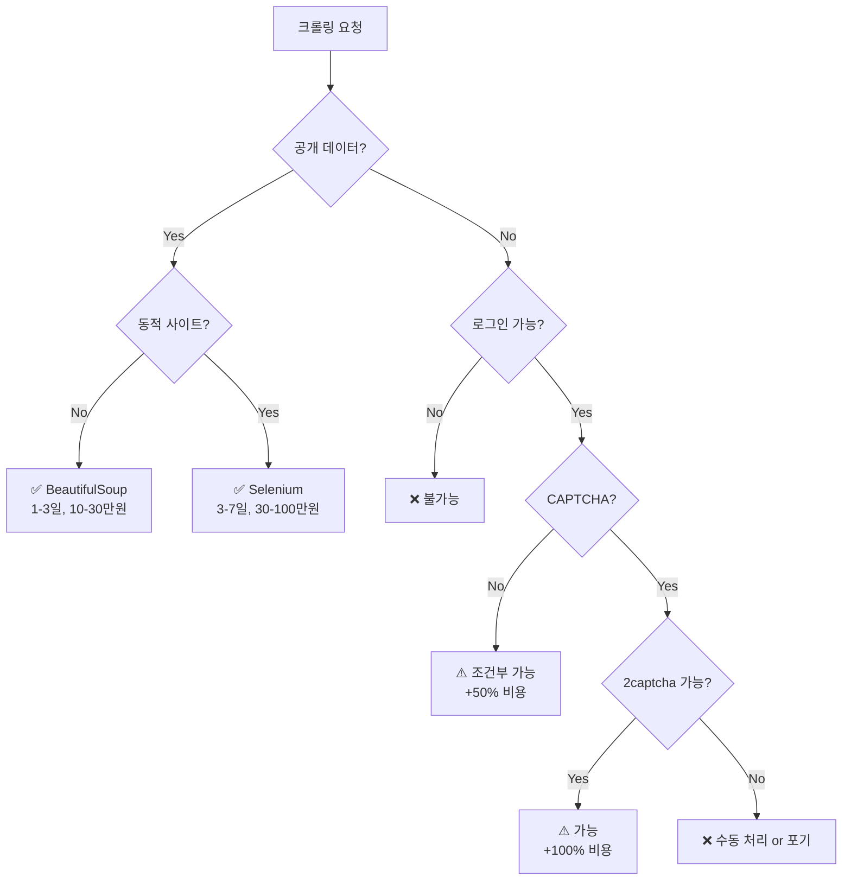

# 🎯 웹 크롤링 가능/불가능 영역 완벽 가이드

> 크몽 클라이언트를 위한 현실적인 크롤링 기술 범위 설명서

## 📋 목차
1. [가능한 크롤링](#-가능한-크롤링)
2. [조건부 가능한 크롤링](#-조건부-가능한-크롤링)
3. [불가능한 크롤링](#-불가능한-크롤링)
4. [법적/윤리적 제약](#️-법적윤리적-제약)
5. [비용과 시간 고려사항](#-비용과-시간-고려사항)

---

## ✅ 가능한 크롤링

### 1. 공개 웹사이트 데이터 수집
**100% 가능한 사이트들:**
- 뉴스 사이트 (네이버, 다음, 조선일보 등)
- 전자상거래 상품 정보 (쿠팡, 11번가, G마켓)
- 부동산 매물 정보 (네이버 부동산, 직방, 다방)
- 블로그 포스트 (티스토리, 네이버 블로그)
- 공공 데이터 포털

**수집 가능한 데이터:**
```python
- 텍스트 콘텐츠 (제목, 본문, 댓글)
- 이미지 URL 및 다운로드
- 가격, 평점, 리뷰
- 연락처 (공개된 경우)
- 메타데이터 (작성일, 조회수 등)
```

### 2. 정적 웹사이트 크롤링
**기술 스택:** BeautifulSoup + Requests
**소요 시간:** 1-3일
**난이도:** ⭐⭐☆☆☆

**예시:**
- 위키피디아 데이터 수집
- 정부 공식 사이트
- 대학 웹사이트
- 기업 홍보 페이지

### 3. 동적 웹사이트 크롤링
**기술 스택:** Selenium + Chrome Driver
**소요 시간:** 3-7일
**난이도:** ⭐⭐⭐☆☆

**예시:**
- 무한 스크롤 사이트 (인스타그램 공개 프로필)
- SPA 웹앱 (React, Vue 기반 사이트)
- 동적 로딩 콘텐츠 (YouTube 댓글)
- AJAX 기반 페이지네이션

### 4. API 활용 크롤링
**기술 스택:** Requests + JSON 파싱
**소요 시간:** 1-2일
**난이도:** ⭐⭐☆☆☆

**예시:**
- 공개 REST API (GitHub, Twitter API v2)
- GraphQL 엔드포인트
- 숨겨진 API 엔드포인트 발견 및 활용
- WebSocket 데이터 스트림

---

## ⚠️ 조건부 가능한 크롤링

### 1. 로그인이 필요한 사이트
**가능 조건:**
- 클라이언트가 계정 정보 제공
- 2FA가 없거나 수동 처리 가능
- 계정 차단 리스크 감수

**난이도:** ⭐⭐⭐⭐☆
**추가 비용:** +30-50%

**예시 및 주의사항:**
```markdown
✅ 가능: 
- 일반 회원 전용 콘텐츠
- 커뮤니티 게시판 (DC인사이드, 클리앙)
- 교육 플랫폼 (인프런, 유데미)

⚠️ 위험:
- LinkedIn (계정 차단 위험 높음)
- Facebook (법적 문제 가능)
- 은행/금융 사이트 (절대 불가)
```

### 2. CAPTCHA가 있는 사이트
**가능 조건:**
- 간단한 이미지 CAPTCHA (2captcha 서비스 활용)
- 수동 해결 허용
- 우회 비용 감수

**난이도:** ⭐⭐⭐⭐☆
**추가 비용:** 
- 2captcha 비용: 1000회당 $3
- 개발 시간 +50%

**성공률:**
```markdown
- 텍스트 CAPTCHA: 90%
- 이미지 선택: 70%
- reCAPTCHA v2: 60%
- reCAPTCHA v3: 30% (매우 어려움)
- hCAPTCHA: 40%
```

### 3. 대용량 데이터 수집
**가능 조건:**
- 충분한 시간 확보
- 프록시 서버 사용
- 분산 크롤링 시스템 구축

**필요 자원:**
```python
데이터량별 예상 시간:
- 1만 개: 1-2시간
- 10만 개: 1-2일
- 100만 개: 1-2주
- 1000만 개: 1-2개월

필요 인프라:
- 프록시: 월 $50-500
- 서버: 월 $100-1000
- 스토리지: 데이터량에 따라 변동
```

### 4. 실시간 모니터링
**가능 조건:**
- 24/7 서버 운영
- 알림 시스템 구축
- 에러 복구 메커니즘

**예시:**
```markdown
✅ 가능:
- 가격 변동 모니터링 (1시간 주기)
- 재고 알림 (5분 주기)
- 뉴스 속보 수집 (1분 주기)

⚠️ 제한사항:
- 초단위 모니터링은 차단 위험
- 서버 비용 급증
- 유지보수 필요
```

---

## ❌ 불가능한 크롤링

### 1. 기술적으로 불가능
**완전 차단된 경우:**
```markdown
❌ Cloudflare Enterprise 보호 (99% 차단)
❌ 지문 인식 기반 차단 (Fingerprinting)
❌ 하드웨어 기반 인증 (USB 키, 생체인식)
❌ 네이티브 모바일 앱 전용 API
❌ 양방향 암호화된 데이터
```

### 2. 법적으로 불가능
**절대 수집 불가:**
```markdown
❌ 개인정보 (주민번호, 전화번호 - 동의 없이)
❌ 저작권 보호 콘텐츠 (넷플릭스, 왓챠)
❌ 금융 거래 정보
❌ 의료 기록
❌ 비공개 대화 내용 (카톡, DM)
❌ 결제 정보 (카드번호 등)
```

### 3. 현실적으로 불가능
**비용/시간 대비 비효율:**
```markdown
❌ 1초에 1000개 이상 요청 (즉시 차단)
❌ 국가 기관 내부 시스템
❌ 기업 인트라넷
❌ VPN 전용 네트워크
❌ 실시간 스트리밍 영상 분석
❌ 네이버/카카오 전체 데이터 수집
```

### 4. 플랫폼별 제약사항

#### Instagram
```markdown
✅ 가능:
- 공개 프로필 정보
- 공개 게시물 (제한적)
- 해시태그 검색 결과

❌ 불가능:
- 프라이빗 계정 콘텐츠
- 스토리 자동 수집
- 팔로워 전체 리스트 (1000명 이상)
- DM 내용
```

#### YouTube
```markdown
✅ 가능:
- 동영상 메타데이터
- 댓글 (공개)
- 채널 정보
- 조회수, 좋아요 수

❌ 불가능:
- 동영상 다운로드 (저작권)
- 수익 정보
- 시청 기록
- 연령 제한 콘텐츠 (로그인 필요)
```

#### 네이버
```markdown
✅ 가능:
- 블로그, 카페 공개 글
- 쇼핑 상품 정보
- 뉴스 기사
- 지식iN 공개 답변

❌ 불가능:
- 네이버 페이 거래 내역
- 메일 내용
- 클로바 노트 내용
- 회원 전용 카페 글
```

---

## ⚖️ 법적/윤리적 제약

### 반드시 확인해야 할 사항
1. **robots.txt 파일 확인**
   ```
   https://example.com/robots.txt
   User-agent: *
   Disallow: /private/
   Crawl-delay: 1
   ```

2. **이용약관 검토**
   - 크롤링 명시적 금지 조항
   - 상업적 이용 제한
   - 데이터 재배포 금지

3. **저작권법**
   - 콘텐츠 무단 복제 금지
   - 데이터베이스권 침해 주의
   - 출처 표시 의무

4. **개인정보보호법**
   - 개인 식별 정보 수집 금지
   - 민감 정보 처리 제한
   - 제3자 제공 시 동의 필요

### 위반 시 처벌
```markdown
⚠️ 민사상 책임:
- 손해배상청구
- 부당이득반환

⚠️ 형사상 책임:
- 업무방해죄 (5년 이하 징역)
- 정보통신망법 위반 (5년 이하 징역, 5천만원 이하 벌금)
- 저작권법 위반 (5년 이하 징역, 5천만원 이하 벌금)
```

---

## 💰 비용과 시간 고려사항

### 프로젝트 규모별 견적

#### 소규모 (1-100 페이지)
```markdown
개발 시간: 1-3일
비용: 10-30만원
기술: BeautifulSoup
난이도: ★☆☆☆☆
```

#### 중규모 (100-10,000 페이지)
```markdown
개발 시간: 3-7일
비용: 30-100만원
기술: Selenium + 멀티스레딩
난이도: ★★★☆☆
추가: 에러 처리, 재시도 로직
```

#### 대규모 (10,000+ 페이지)
```markdown
개발 시간: 1-4주
비용: 100-500만원
기술: Scrapy + 분산 시스템
난이도: ★★★★☆
추가: 프록시, 모니터링, DB 설계
```

#### 엔터프라이즈 (지속적 운영)
```markdown
개발 시간: 1-3개월
비용: 500만원+
기술: 커스텀 프레임워크
난이도: ★★★★★
추가: 유지보수, 스케일링, API 제공
```

### 추가 비용 요소
```python
# 인프라 비용 (월)
프록시 서버: $50-500
클라우드 서버: $100-1000
데이터베이스: $50-500
모니터링 도구: $50-200

# 서비스 비용
CAPTCHA 해결: $3/1000회
SMS 인증: $0.1/건
이메일 인증: $1/100건

# 유지보수 (월)
버그 수정: 개발비의 10%
사이트 변경 대응: 건당 10-50만원
정기 점검: 월 20-100만원
```

---

## 📊 의사결정 플로우차트



---

## 💡 클라이언트 커뮤니케이션 팁

### 1. 초기 상담 시 확인사항
```markdown
✅ 필수 질문:
1. 목표 웹사이트 URL
2. 수집할 데이터 항목
3. 데이터 용도 (상업적/개인적)
4. 필요한 데이터 양
5. 업데이트 주기
6. 예산과 일정
7. 법적 리스크 감수 여부
```

### 2. 기대치 관리 멘트
```markdown
"네, 기술적으로 가능합니다만..."
- "해당 사이트는 robots.txt에서 크롤링을 금지하고 있습니다."
- "로그인이 필요한 경우 계정 차단 위험이 있습니다."
- "CAPTCHA가 있어 추가 비용이 발생합니다."
- "실시간은 어렵고, 5분 주기 정도가 현실적입니다."
- "개인정보가 포함된 데이터는 법적 문제가 있습니다."
```

### 3. 대안 제시
```markdown
❌ "그건 불가능합니다" (X)
✅ "A는 어렵지만, B 방법으로 유사한 결과를 얻을 수 있습니다" (O)

예시:
- "실시간 대신 5분 주기 모니터링은 어떠신가요?"
- "전체 데이터 대신 샘플링은 어떠신가요?"
- "공식 API를 활용하면 더 안정적입니다."
- "수동 개입을 허용하시면 가능합니다."
```

---

## 📝 프로젝트 체크리스트

### 프로젝트 시작 전
- [ ] robots.txt 확인
- [ ] 이용약관 검토
- [ ] 샘플 데이터 수집 테스트
- [ ] 기술적 난이도 평가
- [ ] 법적 리스크 평가
- [ ] 견적 산출
- [ ] 일정 수립

### 개발 중
- [ ] 에러 처리 구현
- [ ] 재시도 로직 구현
- [ ] 로깅 시스템 구축
- [ ] 데이터 검증
- [ ] 성능 최적화
- [ ] 문서화

### 납품 시
- [ ] 소스 코드 전달
- [ ] 사용 매뉴얼 작성
- [ ] 데이터 파일 전달
- [ ] 의존성 목록 제공
- [ ] 유지보수 가이드
- [ ] 법적 고지사항 전달

---

## 🎯 결론

### 핵심 메시지
1. **기술적으로 가능 ≠ 법적으로 가능**
2. **가능하다 ≠ 효율적이다**
3. **한 번 가능 ≠ 지속 가능**

### 성공적인 크롤링 프로젝트를 위해
- 명확한 요구사항 정의
- 현실적인 기대치 설정
- 충분한 시간과 예산 확보
- 법적 검토 선행
- 지속적인 유지보수 계획

### 기억하세요
> "크롤링은 도구일 뿐, 목적이 아닙니다.
> 때로는 공식 API나 파트너십이 더 나은 해결책일 수 있습니다."

---

*이 문서는 2024-2025년 기준으로 작성되었으며,*
*웹 기술과 법규는 계속 변화하므로 정기적인 업데이트가 필요합니다.*

**작성자:** 크롤링 전문가
**최종 수정:** 2025년 8월
**버전:** 1.0