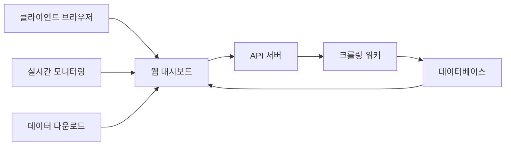

# 🔧 크롤링 툴 패키징 전략 가이드

## 📊 배포 방식 비교 분석

### 1. Windows EXE 인스톨러

#### 👍 장점
```markdown
✅ 클라이언트 편의성
- Python 설치 불필요
- 원클릭 실행
- "전문 소프트웨어" 느낌
- 기술 모르는 사람도 사용 가능

✅ 비즈니스 측면
- 고급스러운 이미지
- 더 높은 가격 책정 가능
- 소스 코드 보호
- 불법 복제 어려움
```

#### 👎 단점
```markdown
❌ 기술적 한계
- 파일 크기 큼 (50-200MB)
- Chrome Driver 별도 관리 필요
- 업데이트 배포 어려움
- 디버깅 매우 어려움
- 백신 오탐지 문제

❌ 유지보수 지옥
- 사이트 변경 시 재배포 필요
- 버그 수정 시 전체 재설치
- 클라이언트 PC 환경 이슈
- 원격 지원 어려움
```

#### 🛠 필요 도구
```python
# PyInstaller (가장 인기)
pip install pyinstaller
pyinstaller --onefile --windowed --icon=app.ico crawler.py

# 문제점:
- 크기: 50MB+
- 속도: 느린 시작
- 백신: 자주 차단됨

# cx_Freeze (대안)
pip install cx_Freeze

# Nuitka (고성능)
pip install nuitka
# C++ 컴파일, 더 작고 빠름
```

---

### 2. Python 스크립트 + 설치 가이드

#### 👍 장점
```markdown
✅ 개발자 친화적
- 쉬운 업데이트
- 즉시 버그 수정
- 투명한 코드
- 커스터마이징 가능
```

#### 👎 단점
```markdown
❌ 클라이언트 부담
- Python 설치 필요
- pip 패키지 설치
- 커맨드라인 사용
- 기술적 장벽 높음
```

---

### 3. 🌟 웹 기반 대시보드 (추천!)

#### 💡 최고의 선택인 이유
```markdown
✨ 완벽한 장점
- 설치 불필요 (브라우저만 있으면 OK)
- 실시간 업데이트
- 모든 OS 지원
- 원격 모니터링
- 프로페셔널한 UI
- 데이터 시각화
- 로그인 기반 보안
```

#### 구현 방법
```python
# Flask/FastAPI + React/Vue
# 백엔드 (FastAPI)
from fastapi import FastAPI
from fastapi.staticfiles import StaticFiles
import uvicorn

app = FastAPI()

@app.post("/api/crawl")
async def start_crawling(config: dict):
    # 크롤링 작업 큐에 추가
    job_id = queue.add_job(config)
    return {"job_id": job_id}

@app.get("/api/status/{job_id}")
async def get_status(job_id: str):
    return {"status": "running", "progress": 45}

# 프론트엔드 서빙
app.mount("/", StaticFiles(directory="frontend/build"))

# Docker 컨테이너로 배포
```

#### 아키텍처


---

### 4. Docker 컨테이너

#### 👍 장점
```markdown
✅ 기술적 우수성
- 환경 일관성 보장
- 쉬운 배포
- 확장 가능
- 마이크로서비스 구조
```

#### 👎 단점
```markdown
❌ 클라이언트 진입장벽
- Docker 설치 필요
- 기술적 이해 필요
- Windows Home 제한
```

---

## 🎯 클라이언트 유형별 추천

### 1. 일반 기업/개인 (기술 모름)
```markdown
🏆 최선: 웹 대시보드
차선: Windows EXE
피해야 할 것: Python 스크립트

제공 사항:
- URL만 전달
- 로그인 계정
- 사용 매뉴얼 (스크린샷 포함)
- 카카오톡 실시간 지원
```

### 2. 스타트업/개발팀
```markdown
🏆 최선: Docker + API
차선: Python 패키지
피해야 할 것: EXE

제공 사항:
- Docker Compose 파일
- API 문서 (Swagger)
- 소스 코드
- 기술 지원
```

### 3. 대기업/공공기관
```markdown
🏆 최선: 온프레미스 서버 설치
차선: 프라이빗 클라우드
피해야 할 것: 외부 웹 서비스

제공 사항:
- 설치 패키지
- 보안 감사 문서
- 운영 매뉴얼
- 현장 교육
```

---

## 💰 가격 전략

### 배포 방식별 가격
```markdown
1. EXE 라이선스
   - 단일 PC: 50-100만원
   - 기업용: 300-500만원
   - 소스 코드 별도

2. 웹 서비스 (SaaS)
   - 월 구독: 10-50만원
   - 사용량 기반: 건당 100원
   - 전용 서버: 월 100만원+

3. 소스 코드 판매
   - 기본: 100-300만원
   - 커스터마이징 포함: 500만원+
   - 교육 포함: +100만원

4. API 서비스
   - 월 10만 요청: 30만원
   - 월 100만 요청: 200만원
   - 무제한: 협의
```

---

## 🚀 실전 구현 예제

### 1. PyInstaller EXE 만들기
```python
# crawler_gui.py
import tkinter as tk
from tkinter import ttk, scrolledtext
import threading
import json

class CrawlerGUI:
    def __init__(self):
        self.window = tk.Tk()
        self.window.title("크롤링 매니저 v1.0")
        self.window.geometry("800x600")
        
        # URL 입력
        tk.Label(self.window, text="Target URL:").pack()
        self.url_entry = tk.Entry(self.window, width=50)
        self.url_entry.pack()
        
        # 시작 버튼
        self.start_btn = tk.Button(
            self.window, 
            text="크롤링 시작",
            command=self.start_crawling
        )
        self.start_btn.pack()
        
        # 진행 상황
        self.progress = ttk.Progressbar(
            self.window,
            length=400,
            mode='determinate'
        )
        self.progress.pack()
        
        # 로그 출력
        self.log_text = scrolledtext.ScrolledText(
            self.window,
            height=20
        )
        self.log_text.pack()
    
    def start_crawling(self):
        url = self.url_entry.get()
        thread = threading.Thread(
            target=self.crawl_worker,
            args=(url,)
        )
        thread.start()
    
    def crawl_worker(self, url):
        self.log("크롤링 시작: " + url)
        # 실제 크롤링 로직
        self.log("크롤링 완료!")
    
    def log(self, message):
        self.log_text.insert(tk.END, message + "\n")
        self.log_text.see(tk.END)
    
    def run(self):
        self.window.mainloop()

# build.spec
# -*- mode: python ; coding: utf-8 -*-
a = Analysis(
    ['crawler_gui.py'],
    pathex=[],
    binaries=[],
    datas=[
        ('config.json', '.'),
        ('assets/*', 'assets'),
    ],
    hiddenimports=['pandas', 'numpy', 'selenium'],
    hookspath=[],
    hooksconfig={},
    runtime_hooks=[],
    excludes=['matplotlib', 'scipy'],
    noarchive=False,
)

# 빌드 명령어
# pyinstaller build.spec
```

### 2. 웹 대시보드 구현
```python
# dashboard.py
from flask import Flask, render_template, jsonify, request
from flask_socketio import SocketIO, emit
import json

app = Flask(__name__)
socketio = SocketIO(app, cors_allowed_origins="*")

@app.route('/')
def index():
    return render_template('dashboard.html')

@app.route('/api/crawl', methods=['POST'])
def start_crawl():
    config = request.json
    job_id = start_crawler_job(config)
    return jsonify({"job_id": job_id})

@socketio.on('subscribe')
def handle_subscribe(data):
    job_id = data['job_id']
    # 실시간 업데이트 전송
    emit('update', {
        'progress': 45,
        'status': 'running',
        'logs': ['데이터 수집 중...']
    })

# HTML 템플릿
"""
<!DOCTYPE html>
<html>
<head>
    <title>크롤링 대시보드</title>
    <script src="https://cdn.socket.io/4.5.4/socket.io.min.js"></script>
    <style>
        .dashboard {
            max-width: 1200px;
            margin: 0 auto;
            padding: 20px;
        }
        .status-card {
            background: white;
            border-radius: 8px;
            padding: 20px;
            box-shadow: 0 2px 4px rgba(0,0,0,0.1);
        }
        .progress-bar {
            width: 100%;
            height: 30px;
            background: #f0f0f0;
            border-radius: 15px;
            overflow: hidden;
        }
        .progress-fill {
            height: 100%;
            background: linear-gradient(90deg, #4CAF50, #45a049);
            transition: width 0.3s;
        }
    </style>
</head>
<body>
    <div class="dashboard">
        <h1>🕷️ 크롤링 대시보드</h1>
        
        <div class="status-card">
            <h2>실시간 상태</h2>
            <div class="progress-bar">
                <div class="progress-fill" style="width: 0%"></div>
            </div>
            <p id="status">대기 중...</p>
        </div>
        
        <div class="status-card">
            <h2>수집 데이터</h2>
            <table id="data-table">
                <!-- 동적 데이터 -->
            </table>
        </div>
    </div>
    
    <script>
        const socket = io();
        
        socket.on('update', (data) => {
            document.querySelector('.progress-fill').style.width = 
                data.progress + '%';
            document.getElementById('status').innerText = 
                data.status;
        });
    </script>
</body>
</html>
"""
```

### 3. Docker 배포
```dockerfile
# Dockerfile
FROM python:3.9-slim

WORKDIR /app

# Chrome 설치
RUN apt-get update && apt-get install -y \
    wget \
    gnupg \
    && wget -q -O - https://dl-ssl.google.com/linux/linux_signing_key.pub | apt-key add - \
    && echo "deb http://dl.google.com/linux/chrome/deb/ stable main" >> /etc/apt/sources.list.d/google.list \
    && apt-get update && apt-get install -y google-chrome-stable

# Python 패키지
COPY requirements.txt .
RUN pip install -r requirements.txt

COPY . .

CMD ["python", "app.py"]

# docker-compose.yml
version: '3.8'
services:
  crawler:
    build: .
    ports:
      - "5000:5000"
    environment:
      - MONGODB_URI=mongodb://mongo:27017
    depends_on:
      - mongo
      - redis
  
  mongo:
    image: mongo:5
    volumes:
      - mongo_data:/data/db
  
  redis:
    image: redis:7
    
volumes:
  mongo_data:
```

---

## 🎯 최종 추천

### 크몽 외주용 최적 전략

```markdown
🏆 베스트 프랙티스:

1단계: Python 스크립트로 개발
2단계: 간단한 GUI 추가 (Tkinter)
3단계: EXE로 패키징 (옵션)
4단계: 웹 대시보드 업셀링

제공 패키지:
- 기본(30만원): Python 스크립트 + 매뉴얼
- 표준(50만원): EXE 파일 + 1개월 지원
- 프리미엄(100만원): 웹 대시보드 + 3개월 지원
- 엔터프라이즈(300만원+): API + 소스코드 + 교육
```

### 차별화 포인트
```python
# 1. 자동 업데이트 기능
def check_update():
    response = requests.get("https://yourserver.com/version")
    if response.json()['version'] > CURRENT_VERSION:
        download_update()

# 2. 원격 모니터링
def send_telemetry():
    data = {
        'client_id': CLIENT_ID,
        'status': 'running',
        'progress': current_progress,
        'errors': error_count
    }
    requests.post("https://yourserver.com/telemetry", json=data)

# 3. 라이선스 관리
def verify_license():
    key = read_license_key()
    response = requests.post(
        "https://yourserver.com/verify",
        json={'key': key, 'hwid': get_hardware_id()}
    )
    return response.json()['valid']
```

---

## 💡 결론

### EXE vs 웹 대시보드

| 항목 | EXE | 웹 대시보드 |
|------|-----|------------|
| 초기 개발 | 쉬움 | 어려움 |
| 유지보수 | 매우 어려움 | 쉬움 |
| 클라이언트 만족도 | 보통 | 높음 |
| 수익성 | 일회성 | 지속적 |
| 확장성 | 낮음 | 높음 |
| 추천도 | ⭐⭐⭐ | ⭐⭐⭐⭐⭐ |

### 최종 조언
> "처음엔 Python 스크립트로 빠르게 납품하고,
> 클라이언트 반응이 좋으면 웹 대시보드로 업그레이드 제안하세요.
> EXE는 정말 필요한 경우에만 만드세요."

---

*이 문서는 실전 경험을 바탕으로 작성되었습니다.*
*크몽에서 성공하세요! 💪*