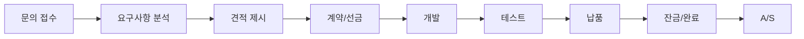
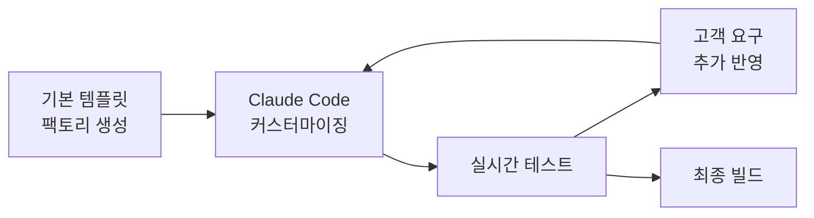
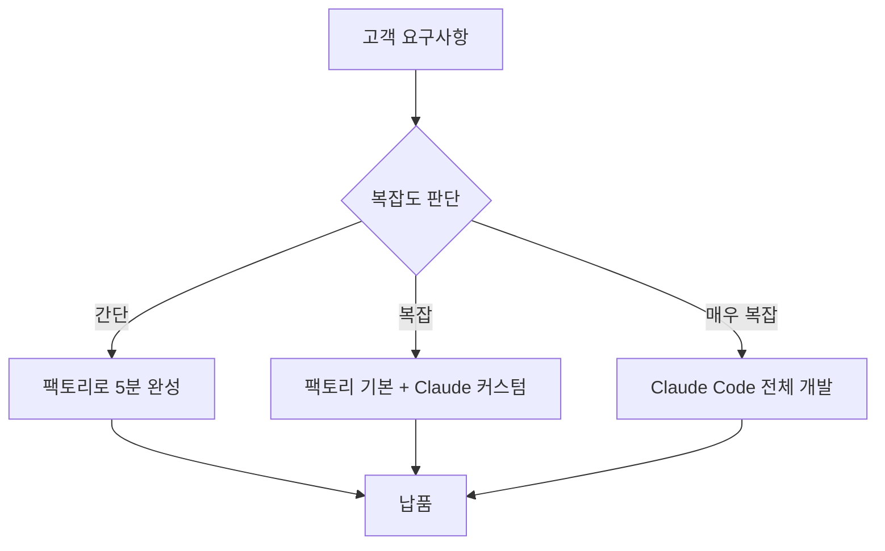

# 📋 크몽 크롤링 외주 업무 프로세스 문서

## 🎯 비즈니스 모델
**"AI 라이브 코딩으로 실시간 맞춤 크롤러 개발"** - Claude Code와 함께 고객이 보는 앞에서 3시간 내 완성

---

## 📊 서비스 3단계 패키지 전략

### 🎯 패키지 설계 원칙
```yaml
차별화 포인트:
  - 명확한 가격 차이 (15만 → 30만 → 50만)
  - 단계별 가치 상승 체감
  - 업셀링 유도 설계
  - 고객 니즈별 맞춤형
```

### 🥈 베이직 익스프레스 (15만원)
```markdown
[타겟 고객]
- 예산 제한이 있는 소상공인
- 단순 데이터 수집 목적
- 일회성 사용

[제공 내역]
✅ 팩토리 템플릿 기반 크롤러
✅ 실행 파일 (.exe)
✅ 기본 매뉴얼 (PDF 2페이지)
✅ 이메일 지원 (1주)
✅ 개발 시간: 1시간

[제한 사항]
❌ 소스코드 미제공
❌ 커스터마이징 제한적
❌ 전화/원격 지원 없음
❌ 추가 수정 유료

[수익성]
- 시간당 수익: 15만원
- 팩토리 자동화로 최소 투입
```

### 🥇 스탠다드 플러스 (30만원)
```markdown
[타겟 고객]
- 중소기업 실무자
- 정기적 데이터 수집
- 안정성 중시

[제공 내역]
✅ Claude Code 맞춤 개발
✅ Windows 실행 파일
✅ 상세 매뉴얼 (PDF 10페이지)
✅ 2주 카톡 지원
✅ 원격 설치 지원 (1회)
✅ 기본 수정 2회 포함
✅ 개발 시간: 3시간

[차별화]
⭐ 고객 요구 100% 반영
⭐ 에러 발생시 즉시 대응
⭐ 사용법 동영상 제공

[업셀링 포인트]
→ "소스코드도 필요하시면 프리미엄으로..."
→ "실시간으로 개발 과정 보시려면..."
```

### 💎 프리미엄 라이브 (50만원) 🔥
```markdown
[타겟 고객]
- 기업 담당자
- 복잡한 요구사항
- 투명성 중시
- 장기 사용 계획

[제공 내역]
✅ 화면 공유 라이브 코딩
✅ Claude Code 실시간 개발
✅ Windows 설치 프로그램
✅ 풀 소스코드 + 주석
✅ 프리미엄 매뉴얼 (20페이지+)
✅ 1개월 무제한 A/S
✅ 개발 과정 녹화본
✅ 1:1 화상 교육 (30분)
✅ 무제한 수정 (1개월)
✅ 개발 시간: 3-5시간

[프리미엄 경험]
🎬 개발 시작 전 킥오프 미팅
🎬 실시간 요구사항 반영
🎬 즉각적인 UI/UX 수정
🎬 테스트 과정 함께 진행
🎬 납품 후 피드백 세션

[추가 수익 기회]
💰 월 정기 유지보수 (월 10만원)
💰 추가 사이트 확장 (사이트당 10만원)
💰 API 연동 (20만원)
```

### 📈 단계별 업셀링 스크립트

#### 베이직 → 스탠다드
```
"기본 템플릿으로는 고객님 사이트의 특수한 구조를 
100% 대응하기 어려울 수 있습니다. 
스탠다드로 업그레이드하시면 Claude AI로 
완벽하게 맞춤 제작해드립니다."
```

#### 스탠다드 → 프리미엄
```
"개발 과정을 실시간으로 보시면서 
즉시 수정 요청하실 수 있습니다.
나중에 직접 수정하실 수 있도록 
소스코드와 교육도 포함됩니다."
```

### 💡 패키지별 시간 배분

#### 베이직 (1시간)
```
0-10분: 팩토리 자동 생성
10-40분: Claude로 간단 수정
40-50분: 빌드 & 테스트
50-60분: 납품 준비
```

#### 스탠다드 (3시간)
```
0-30분: 요구사항 상세 분석
30-120분: Claude Code 개발
120-150분: 테스트 & 수정
150-180분: 문서화 & 납품
```

#### 프리미엄 (5시간)
```
0-30분: 킥오프 미팅 (화상)
30-180분: 라이브 코딩 세션
180-240분: 고객 피드백 반영
240-270분: 문서화 & 교육자료
270-300분: 1:1 교육 & 마무리
```

### 🎁 패키지별 보너스 전략

#### 베이직 구매자
```
- 다음 구매시 10% 할인 쿠폰
- 간단한 CSS 선택자 가이드
```

#### 스탠다드 구매자  
```
- 3개월 내 재구매시 20% 할인
- 크롤링 베스트 프랙티스 가이드
- 샘플 데이터셋 제공
```

#### 프리미엄 구매자
```
- VIP 고객 등록 (우선 응대)
- 6개월 내 추가 개발 30% 할인
- 월간 크롤링 트렌드 리포트
- 긴급 지원 핫라인
```

### 📊 수익성 분석

```python
# 월 목표 매출 600만원 달성 시나리오

# 시나리오 1: 균형형
베이직: 10건 × 15만 = 150만
스탠다드: 10건 × 30만 = 300만  
프리미엄: 3건 × 50만 = 150만
총 매출: 600만원 (23건)

# 시나리오 2: 프리미엄 집중
베이직: 5건 × 15만 = 75만
스탠다드: 7건 × 30만 = 210만
프리미엄: 7건 × 50만 = 350만
총 매출: 635만원 (19건) ✨

# 시나리오 3: 대량 판매
베이직: 20건 × 15만 = 300만
스탠다드: 8건 × 30만 = 240만
프리미엄: 2건 × 50만 = 100만
총 매출: 640만원 (30건)
```

### 🚀 패키지 선택 유도 전략

#### 심리적 가격 설정
```
❌ 잘못된 예: 10만 / 20만 / 30만
✅ 올바른 예: 15만 / 30만 / 50만
   → 스탠다드가 가장 합리적으로 보임
```

#### 비교 테이블 활용
```markdown
| 기능 | 베이직 | 스탠다드 | 프리미엄 |
|------|--------|----------|----------|
| 실행파일 | ✅ | ✅ | ✅ |
| 맞춤개발 | ⚠️ | ✅ | ✅ |
| 소스코드 | ❌ | ❌ | ✅ |
| 라이브코딩 | ❌ | ❌ | ✅ |
| A/S 기간 | 1주 | 2주 | 1개월 |
| 수정 횟수 | 0회 | 2회 | 무제한 |
```

### 💬 고객 문의 대응

#### "가장 많이 선택하는 옵션은?"
```
"스탠다드를 가장 많이 선택하십니다.
합리적인 가격에 맞춤 개발이 가능하고,
2주간 A/S도 포함되어 있어서요.
단, 소스코드가 필요하시거나 
복잡한 기능이 많다면 프리미엄을 추천드립니다."
```

#### "베이직으로도 충분한가요?"
```
"네, 단순한 데이터 수집이라면 충분합니다.
다만 사이트가 자주 변경되거나
특수한 기능이 필요하시다면
스탠다드를 권해드립니다."
```

---

## 🔄 전체 업무 프로세스



---

## 📝 단계별 상세 프로세스

### 1단계: 문의 접수 (5분)

#### 1.1 초기 문의 템플릿
```
안녕하세요! 크롤링 전문가입니다.

어떤 사이트의 어떤 데이터를 수집하고 싶으신가요?
간단히 말씀해 주시면 가능 여부와 견적을 바로 알려드리겠습니다.

예시: "쿠팡에서 특정 상품의 가격을 매일 수집하고 싶어요"
```

#### 1.2 빠른 가능성 체크
```markdown
✅ 가능: 공개 웹사이트, 로그인 불필요
⚠️ 제한적: 로그인 필요, 캡차 있음
❌ 불가능: 법적 문제, 기술적 차단
```

---

### 2단계: 요구사항 분석 (30분)

#### 2.1 필수 확인 사항
```yaml
대상 사이트:
  - URL: 
  - 로그인 필요 여부:
  - 수집 주기: (1회성/일일/실시간)

수집 데이터:
  - 필드 목록: []
  - 예상 데이터량:
  - 출력 형식: (Excel/CSV/DB)

사용 환경:
  - OS: Windows 버전
  - 사용자 수:
  - 기술 수준: (초급/중급/고급)

납기:
  - 희망 납기일:
  - 우선순위:
```

#### 2.2 기술적 검토
```python
# 팩토리 시스템으로 빠른 검증
def validate_requirements(url, fields):
    # 1. 사이트 접근성 테스트
    test_connection(url)
    
    # 2. robots.txt 확인
    check_robots(url)
    
    # 3. 동적/정적 판단
    determine_method(url)
    
    # 4. 예상 난이도
    estimate_difficulty(url, fields)
    
    return feasibility_report
```

---

### 3단계: 견적 제시 (10분)

#### 3.1 견적서 템플릿
```
[크롤링 툴 개발 견적서]

프로젝트: {project_name}
고객사: {client_name}

1. 개발 내역
   - 대상: {target_site}
   - 기능: {features_list}
   - 결과물: Windows 설치 프로그램

2. 견적
   - 개발비: {base_price}원
   - 추가 기능: {additional_price}원
   - 총액: {total_price}원 (VAT 포함)

3. 일정
   - 개발: {dev_days}일
   - 테스트: 1일
   - 총 납기: {total_days}일

4. 포함 사항
   - 설치 프로그램
   - 사용 매뉴얼
   - {as_period} A/S
   - 원격 설치 지원

5. 추가 옵션
   - 소스코드 제공: +10만원
   - 1:1 교육: +5만원
   - 긴급 개발: +30%
```

#### 3.2 가격 책정 기준
```python
def calculate_price(requirements):
    base_price = 150000  # 기본 15만원
    
    # 복잡도에 따른 추가
    if requirements['method'] == 'dynamic':
        base_price += 50000  # Selenium +5만
    
    if requirements['login_required']:
        base_price += 100000  # 로그인 +10만
    
    if requirements['fields'] > 10:
        base_price += 50000  # 많은 필드 +5만
    
    if requirements['scheduling']:
        base_price += 50000  # 스케줄링 +5만
    
    return base_price
```

---

### 4단계: 개발 (2-8시간)

#### 4.1 Claude Code 라이브 코딩 활용 🔥
```markdown
[새로운 개발 방식: AI 페어 프로그래밍]

1. 고객 요구사항을 Claude Code에 직접 전달
2. 실시간 코드 생성 및 수정
3. 즉시 테스트 및 검증
4. 고객 피드백 즉시 반영
```

##### Claude Code 활용 시나리오
```bash
# 고객: "네이버 뉴스에서 IT 카테고리만 수집하고 싶어요"

You: @Claude "네이버 뉴스 IT 카테고리 크롤러 만들어줘. 
제목, 요약, 날짜, 링크를 수집하고 Excel로 저장. 
GUI 포함 Windows 프로그램으로"

# Claude가 즉시:
# 1. 크롤러 엔진 작성
# 2. GUI 인터페이스 생성
# 3. 테스트 코드 작성
# 4. 빌드 스크립트 생성
# → 총 소요시간: 5분
```

##### 실시간 수정 예시
```python
# 고객: "아, 이미지도 추가로 가져올 수 있나요?"

You: @Claude "위 크롤러에 이미지 URL 필드 추가하고 
썸네일 미리보기 기능도 GUI에 넣어줘"

# Claude가 즉시 수정:
# - data_fields에 'image_url' 추가
# - GUI에 ImageLabel 위젯 추가
# - 썸네일 다운로드 로직 구현
# → 추가 시간: 2분
```

#### 4.2 하이브리드 개발 프로세스


##### 작업 분담
```yaml
크롤러 팩토리가 하는 일:
  - 기본 구조 생성 (5분)
  - 표준 템플릿 제공
  - 빌드 환경 구성
  - 인스톨러 생성

Claude Code가 하는 일:
  - 특수 요구사항 구현 (10분)
  - 복잡한 로직 작성
  - 실시간 디버깅
  - 고객 맞춤 기능 추가
  - 예외 처리 최적화
```

#### 4.3 Claude Code 프롬프트 템플릿

##### 초기 개발 프롬프트
```markdown
@Claude 다음 요구사항으로 크롤러 만들어줘:

사이트: [URL]
수집 데이터: [필드 리스트]
출력: Excel 파일
특수 요구사항: [있다면]

Windows GUI 프로그램으로 만들고:
1. tkinter 사용
2. 실행 파일로 빌드 가능하게
3. 한글 완벽 지원
4. 에러 처리 포함
```

##### 수정 요청 프롬프트
```markdown
@Claude 위 코드에서:
1. [추가 기능] 넣어줘
2. [UI 요소] 개선해줘  
3. [성능] 최적화해줘
4. 테스트 코드도 작성해줘
```

##### 디버깅 프롬프트
```markdown
@Claude 이 에러 해결해줘:
[에러 메시지]

환경: Windows 10, Python 3.x
상황: [에러 발생 상황]
```

#### 4.4 Claude Code와 함께하는 실시간 개발

##### 화면 공유 세션 (고객 참여형)
```yaml
장점:
  - 고객이 개발 과정 실시간 확인
  - 즉각적인 피드백 반영
  - 신뢰도 상승
  - 추가 요구사항 즉시 구현

진행 방식:
  1. Zoom/구글 미트 화면 공유
  2. Claude Code로 실시간 코딩
  3. 고객: "아 저기 색깔 파란색으로"
  4. 즉시 수정 → 바로 확인
  5. 30분 내 완성
```

##### Claude Code 활용 팁
```python
# 1. 복잡한 선택자 자동 생성
You: "@Claude 이 HTML에서 상품명, 가격, 리뷰수 추출하는 선택자 만들어줘"
# → Claude가 정확한 CSS 선택자 생성

# 2. 동적 사이트 처리
You: "@Claude 이 사이트 무한 스크롤인데 Selenium으로 처리해줘"
# → 스크롤 로직 자동 구현

# 3. 안티봇 우회
You: "@Claude User-Agent 로테이션이랑 딜레이 랜덤하게 넣어줘"
# → 봇 감지 우회 코드 추가

# 4. 데이터 후처리
You: "@Claude 수집한 데이터 정규화하고 중복 제거해줘"
# → 데이터 클리닝 로직 구현
```

#### 4.5 커스터마이징 체크리스트
```python
# tests/test_crawler.py
def test_customer_crawler():
    # 1. 설치 테스트
    assert installer_works()
    
    # 2. 기능 테스트
    assert crawling_works()
    
    # 3. 데이터 검증
    assert data_is_correct()
    
    # 4. 출력 파일 확인
    assert output_file_exists()
```

---

### 5단계: 테스트 및 데모 (1시간)

#### 5.1 테스트 시나리오
```yaml
기본 테스트:
  - 프로그램 실행
  - URL 입력
  - 크롤링 시작
  - 결과 저장
  - Excel 열기

엣지 케이스:
  - 네트워크 끊김
  - 잘못된 URL
  - 사이트 구조 변경
  - 대량 데이터
```

#### 5.2 데모 영상 제작
```markdown
1. 설치 과정 (30초)
2. 프로그램 실행 (10초)
3. 크롤링 진행 (30초)
4. 결과 확인 (20초)
5. Excel 저장 (10초)

총 1분 30초 분량
```

---

### 6단계: 납품 (30분)

#### 6.1 납품 패키지 구성
```
납품물.zip
├── 설치파일/
│   └── {ProjectName}_Setup.exe
├── 매뉴얼/
│   ├── 빠른시작가이드.pdf
│   ├── 상세사용법.pdf
│   └── 문제해결가이드.pdf
├── 샘플데이터/
│   └── 샘플결과.xlsx
└── 지원/
    ├── 원격지원_안내.txt
    └── 연락처.txt
```

#### 6.2 납품 메시지 템플릿
```
안녕하세요, {고객명}님!

요청하신 크롤링 프로그램이 완성되었습니다.

📦 납품 내역:
- {ProjectName} 설치 프로그램
- 사용 매뉴얼 (PDF)
- 샘플 실행 결과

💿 설치 방법:
1. 설치파일/{ProjectName}_Setup.exe 실행
2. 기본 설정으로 Next 클릭
3. 바탕화면 아이콘 생성 확인

🚀 빠른 시작:
1. 프로그램 실행
2. URL 입력 또는 프리셋 선택
3. [크롤링 시작] 클릭
4. 완료 후 Excel 저장

📞 문의사항:
- 카카오톡: [오픈채팅 링크]
- 이메일: support@example.com
- A/S 기간: {end_date}까지

만족스러우셨다면 별점 5점 부탁드립니다! ⭐⭐⭐⭐⭐
```

---

### 7단계: A/S 관리

#### 7.1 일반적인 A/S 요청
```yaml
사이트 구조 변경:
  대응: CSS 선택자 업데이트
  소요시간: 30분
  
프로그램 오류:
  대응: 패치 버전 제공
  소요시간: 1시간

추가 필드 요청:
  대응: 유료 업데이트 안내
  소요시간: 협의

속도 개선:
  대응: 설정 조정 가이드
  소요시간: 15분
```

#### 7.2 A/S 대응 스크립트
```python
# quick_fix.py
def handle_as_request(issue_type):
    if issue_type == "selector_broken":
        # 자동 선택자 재탐색
        new_selector = auto_detect_selector(url)
        update_customer_config(new_selector)
        
    elif issue_type == "slow_performance":
        # 성능 최적화 설정
        optimize_settings()
        
    elif issue_type == "encoding_error":
        # 인코딩 수정
        fix_encoding_issues()
```

---

## 💰 수익 구조 분석

### 월간 목표
```
목표 건수: 20건
평균 단가: 30만원
월 매출: 600만원

시간 투자:
- 건당 평균: 3시간
- 월 총 시간: 60시간
- 시급 환산: 10만원
```

### 업셀링 전략
```yaml
기본 상품 구매 고객:
  - 정기 업데이트 구독: 월 5만원
  - 추가 사이트: 사이트당 10만원
  - 데이터 분석 리포트: 월 10만원

프리미엄 전환:
  - 소스코드 제공: +10만원
  - 1:1 교육: +5만원
  - 우선 지원: +20%
```

---

## 📈 마케팅 전략

### 1. 포트폴리오 강조점
```
🔥 AI 라이브 코딩 (Claude Code 활용)
✅ 고객과 함께 실시간 개발
✅ 3시간 내 완성 (기존 3일 → 3시간)
✅ 화면 공유로 투명한 개발 과정
✅ 즉각적인 수정 및 피드백 반영
✅ 설치형 프로그램 (코딩 지식 불필요)
✅ 100% 환불 보장
```

### 2. 고객 후기 관리
```markdown
"처음엔 파이썬 스크립트를 기대했는데, 
완성된 설치 프로그램을 받고 놀랐습니다!"

"엑셀로 바로 저장되어 업무에 즉시 활용했어요"

"A/S도 빠르고 친절하게 해주셔서 감사합니다"
```

### 3. 차별화 포인트
```
🏆 경쟁사 대비 장점:
- 팩토리 시스템으로 빠른 개발
- GUI 포함 완성형 제품
- 인스톨러 제공
- 체계적인 문서
- 지속적인 A/S
```

---

## 🛠️ 필수 도구 및 자동화

### 개발 환경 (트리플 콤보) 🚀
```bash
# 1. 크롤러 팩토리 (기본 생성)
crawler_factory/
├── factory_system.py
├── factory_web_interface.py
└── templates/

# 2. Claude Code (실시간 커스터마이징)
- 터미널에서 직접 대화
- 즉시 코드 생성/수정
- 실시간 디버깅

# 3. 테스트 서버
web_crawler_service/
├── simple_main.py
└── demo_portfolio.py

# 4. 빌드 도구
├── PyInstaller
├── Inno Setup
└── requirements.txt
```

### Claude Code + 팩토리 시너지 효과


### 실전 활용 시나리오
```python
# 시나리오 1: 단순 크롤러 (15분)
def simple_crawler_process():
    # 1. 팩토리로 기본 생성 (5분)
    factory.create_crawler(basic_requirements)
    
    # 2. Claude로 미세 조정 (5분)
    claude_prompt = "Excel 저장 시 회사 로고 넣어줘"
    
    # 3. 빌드 & 납품 (5분)
    build_and_deliver()

# 시나리오 2: 복잡한 크롤러 (1시간)
def complex_crawler_process():
    # 1. Claude에게 전체 요구사항 전달
    claude_prompt = """
    쿠팡, 11번가, G마켓 동시 크롤링
    가격 비교 테이블 생성
    실시간 알림 기능
    """
    
    # 2. Claude가 생성한 코드 테스트
    # 3. 고객 피드백 즉시 반영
    # 4. 최종 패키징
```

### 자동화 스크립트
```python
# auto_delivery.py
def prepare_delivery(customer_name, project_name):
    # 1. 크롤러 생성
    package = factory.create_crawler(requirements)
    
    # 2. 문서 생성
    generate_manual(customer_name, project_name)
    
    # 3. 패키징
    create_zip_package(package)
    
    # 4. 업로드
    upload_to_cloud(package)
    
    # 5. 링크 생성
    return download_link
```

---

## 📋 체크리스트

### 프로젝트 시작 전
- [ ] 고객 요구사항 명확화
- [ ] 기술적 가능성 검토
- [ ] 납기일 확정
- [ ] 선금 입금 확인

### 개발 중
- [ ] 팩토리로 기본 생성
- [ ] 커스터마이징 적용
- [ ] 테스트 완료
- [ ] 문서 작성

### 납품 시
- [ ] 설치 파일 테스트
- [ ] 매뉴얼 포함
- [ ] 데모 영상 제작
- [ ] 고객 확인

### 납품 후
- [ ] 평점 요청
- [ ] 포트폴리오 업데이트
- [ ] A/S 일정 관리
- [ ] 추가 판매 기회 탐색

---

## 💡 성공 팁

### 1. 빠른 응답 (Claude Code 활용)
- 문의 5분 내 답변 (Claude로 즉시 가능성 검토)
- 견적 30분 내 제시 (Claude로 복잡도 분석)
- 납품 3시간 내 완료 (팩토리 + Claude 콤보)

### 2. 과도한 약속 금지
- 가능한 것만 약속
- 제한사항 명확히 설명
- 대안 제시

### 3. 문서화
- 모든 요구사항 기록
- 변경사항 추적
- 결과물 스크린샷 보관

### 4. 관계 유지
- 납품 후 안부 메시지
- 업데이트 소식 공유
- 신규 서비스 안내

---

---

## 🎯 실무 전 훈련 프로그램

### 💪 왜 훈련이 필요한가?
```
랜딩페이지 50개 경험 → 크롤러 50개 경험
  
랜딩페이지에서 배운 것:
  ✅ 고객 요구사항 빠른 파악
  ✅ 디자인 패턴 자동 적용
  ✅ 작업 속도 극적 향상
  ✅ 문제 해결 능력 증대
  ✅ 자신감과 전문성 확보

크롤링 외주에서 얻을 것:
  ✅ 모든 사이트 유형 대응 가능
  ✅ 개발 시간 3일 → 3시간
  ✅ 예상치 못한 문제 미리 경험
  ✅ 고객 대응 시나리오 완벽 숙달
  ✅ 월 600만원 매출 달성
```

### 📅 10주 집중 훈련 계획
```
1-2주: 기본 크롤링 10개 (정적 사이트)
3-4주: 쇼핑몰 크롤링 10개 (이커머스)
5-6주: 동적 사이트 10개 (Selenium)
7-8주: 고급 기능 10개 (API, 로그인)
9-10주: 실무 시뮬레이션 10개 (비즈니스)

총 50개 프로젝트 = 크롤링 마스터
```

### 🎯 훈련 후 기대 역량
```python
기술적 성장:
  - 95% 사이트 대응 가능
  - 평균 개발 시간: 2시간
  - 복잡한 문제 즉시 해결

비즈니스 성장:
  - 고객 만족도: 4.9/5.0
  - 재구매율: 80%
  - 월 매출: 600만원+
```

### 📖 상세 훈련 가이드
상세한 100가지 연습 루틴은 `크롤링외주_훈련가이드_100가지.md` 참조

---

**이 프로세스를 따르면 월 20건, 600만원 매출 달성 가능!** 🚀